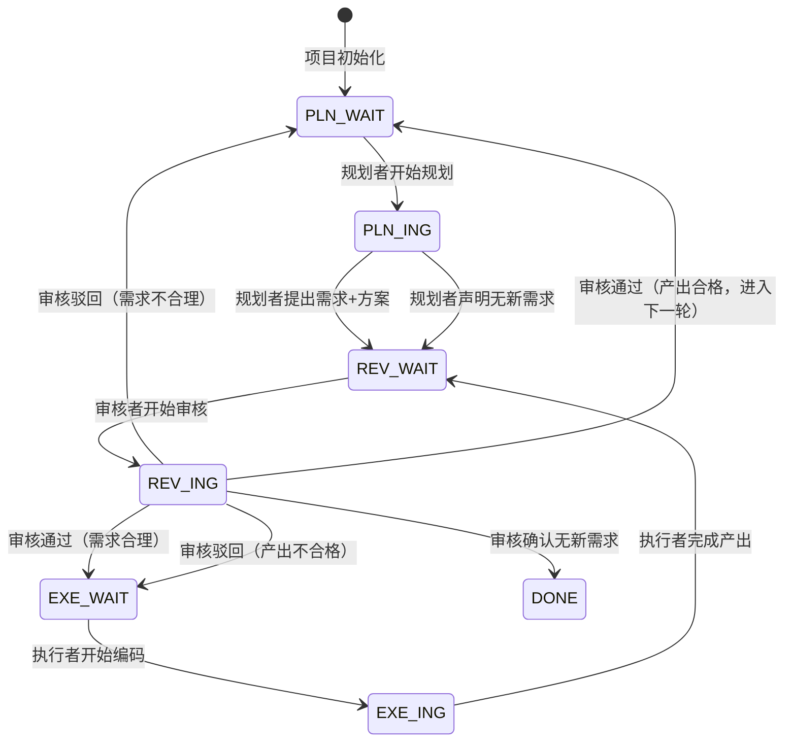

# PRE 状态体系参考

## 状态码定义

状态码格式为 `角色缩写_阶段`，共7个：

| 状态码 | 含义 | 声明者 |
|--------|------|--------|
| `PLN_WAIT` | 需要规划者提出下一个需求或声明无新需求 | 审核者 |
| `PLN_ING` | 规划者正在分析目标与代码，制定需求与方案 | 规划者 |
| `REV_WAIT` | 有内容等待审核者审核（需求/无新需求声明/产出） | 规划者/执行者 |
| `REV_ING` | 审核者正在审核 | 审核者 |
| `EXE_WAIT` | 需求审核通过，等待执行者编码实现 | 审核者 |
| `EXE_ING` | 执行者正在按方案编码实现 | 执行者 |
| `DONE` | 项目目标中所有需求已交付，无新需求 | 审核者 |

## 状态流转

## 声明规则

- 规划者声明：`PLN_ING` → `REV_WAIT`
- 执行者声明：`EXE_ING` → `REV_WAIT`
- 审核者声明：`REV_ING` → `EXE_WAIT`/`PLN_WAIT`/`DONE`

`DONE`的达成条件：规划者在`PLN_WAIT`状态下读取项目目标文档，判定无新的需求后，提交"无新需求"声明并声明状态`REV_WAIT`。审核者审核该声明，确认项目目标已全部交付后，声明`DONE`。

## 三角色行为对照表

| 状态 | 规划者 | 执行者 | 审核者 |
|------|--------|--------|--------|
| `PLN_WAIT` | **行动**：读取目标+代码，有新需求则规划，无则提交声明 | 跳过 | 跳过 |
| `PLN_ING` | 继续规划 | 跳过 | 跳过 |
| `REV_WAIT` | 跳过 | 跳过 | **行动**：读取目标+代码+日志，开始审核 |
| `REV_ING` | 跳过 | 跳过 | 继续审核 |
| `EXE_WAIT` | 跳过 | **行动**：读取目标+代码，开始执行 | 跳过 |
| `EXE_ING` | 跳过 | 继续执行 | 跳过 |
| `DONE` | 跳过 | 跳过 | 跳过 |

## 各角色可声明的状态码

**规划者可声明**：`PLN_ING`、`REV_WAIT`

**执行者可声明**：`EXE_ING`、`REV_WAIT`

**审核者可声明**：`REV_ING`、`EXE_WAIT`、`PLN_WAIT`、`DONE`

## 协作链路

**PLN_WAIT → 规划者规划 → REV_WAIT → 审核者审核需求 → EXE_WAIT → 执行者执行 → REV_WAIT → 审核者审核产出 → PLN_WAIT（下一轮）**

`DONE`只发生在审核者审核规划者的规划环节。